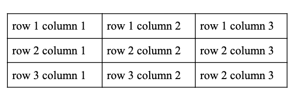
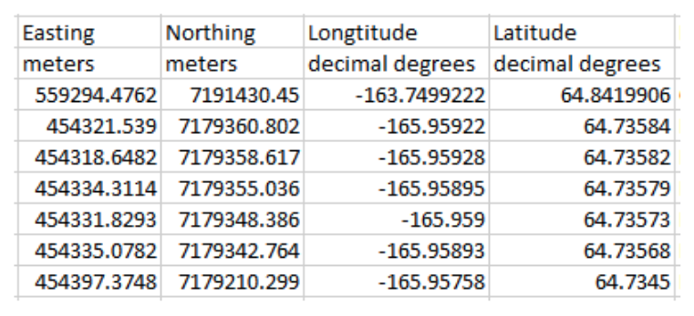

# Detailed Guide to the CSV Reporting Format Elements

## Contents of the Elements 

[File Structure](#file-structure)  
* [Character Set](#character-set)  
* [Delimiter](#delimiter)  
* [Data Matrix](#data-matrix)  
* [Column or Row Name Orientation](#column-or-row-name-orientation)  

[Naming Structure](#naming-structure)  
* [File Name](#file-name)  
* [Column or Row Name](#column-or-row-names)  
* [Units](#units)  

[Field Structure](#field-structure)  
* [Consistent Values](#consistent-values)  
* [Missing Value Codes](#missing-value-codes)  
* [Temporal Data](#temporal-data)  
* [Temporal Data Range](#temporal-data-range)  
* [Spatial Data](#spatial-data)  

---

## File Structure

#### **Character Set**

Use the standard US-ASCII character set without extensions (no characters beyond the 127 characters) (Table 1) or use UTF-8 (which includes the ASCII character set).  

The US-ASCII characters include all upper- and lowercase characters, digits, and common punctuation used in the English language. Most English-language dataset submissions will require only characters included in the standard ASCII character set; however, UTF-8 is useful since it can support non-English characters.  

Data in a computer is represented and stored as bytes (numeric values). A character encoding scheme (e.g. ASCII, UTF-8) is used to map and translate bytes from computers into human-readable characters. Using either of these character encodings  will increase machine readability and interoperability.  

  
Table 1. The ASCII Character Set. Control characters.  

--- 

#### **Delimiter**

Save tabular data in comma separated values (CSV) format. The delimiter between columns is the comma character ",".   

For commas not meant to be a delimiter (e.g. used within a cell), use a vertical bar "|" or semicolon ";" instead of a comma or protect the comma with matching double quotation marks around the entire value.  

This requirement is necessary for machine readability as unprotected commas will disrupt the interpretation of columns and rows.

Examples:
- Example using a semicolon ";" instead of a comma  
&nbsp;&nbsp;&nbsp;&nbsp;Doe; Jane  
&nbsp;&nbsp;&nbsp;&nbsp;Standing water; ponded  
&nbsp;&nbsp;&nbsp;&nbsp;Area A; Area B; Area C

- Example using enclosed quotes around the cell entries containing commas   
&nbsp;&nbsp;&nbsp;&nbsp;"Doe, Jane"  
&nbsp;&nbsp;&nbsp;&nbsp;"Standing water, ponded"  
&nbsp;&nbsp;&nbsp;&nbsp;“Area A, Area B, Area C”

If data providers enter their data into programs like Microsoft Excel or Libre Office, commas that are used within cells will be detected and protected by quotation marks automatically. Data that are output from models or written in a simple text editor might need quotation marks added to text cells manually.

Example of cell entries separated by commas and protection quotes around “sunny, ponding” as viewed in Notepad++

--- 

#### **Data Matrix** 

The contents of the data portion of the file must be organized in a logical and readable matrix format. There can be no empty rows and there must be the same number of columns across all of its rows.  Dataset creators may want to consider ending CSV files with a `newline` character `\n` which indicates to any CSV reader that it has read the end of the CSV file.  

  

Well formatted  

  

Not well formatted  

  

--- 

#### **Column or Row Name Orientation**

The Data Matrix portion of each file should contain a header Column or Row that follows the naming conventions listed under the section [Column/Row names](#column-or-row-names). The Column/Row Names will identify the type of information found in that Column or Row.

The orientation of the Column/Row Names in the Data Matrix could be presented:  
&nbsp;&nbsp;&nbsp;&nbsp;1. Horizontally with Names at the top of each column or   
&nbsp;&nbsp;&nbsp;&nbsp;2. Vertically with Names at the start of each row.  

Describe the orientation of the header within the data matrix of the data file in the File-level Metadata.

Example of a Column Names presented horizontally (highlighted) visualized in Excel.

  

Example of Row Names presented vertically (highlighted) visualized in Excel.

  

--- 

## Naming Structure

#### **File Name**

Provide unique file names that are as descriptive as possible about the file contents. Use only letters (e.g. CamelCase), numbers, hyphens, and underscores "\_". Do not include spaces. Do not start with an underscore or hyphen.

Examples:  
* burned_plot_veg_2016.csv  
* SoilPoreWaterHillslope2019.csv

---

#### **Column or Row Names**

Provide unique Column or Row Names that convey basic information about the contents of each column or row. Use only letters, numbers, hyphens, and underscores. Do not include spaces and recommend not using CamelCase. Do not start with an underscore or hyphen and recommend not starting with a number.

Descriptions of the information found in each column or row should be reported and defined in the CSV Data Dictionary (CSV_dd.csv).

Examples:    
* soil_H20  
* corr_delta13C_stdev  

--- 

#### **Units**

Provide the units of measurement for the variable in one of the following ways:  
&nbsp;&nbsp;&nbsp;&nbsp;1. Immediately below the Column Name as a next row or immediately adjacent to the Row Name as next column; and/or  
&nbsp;&nbsp;&nbsp;&nbsp;2. Only in the CSV Data Dictionary (CSV_dd.csv)

Insert "N/A" when units aren't applicable.  

Report and define additional information on units in the CSV Data Dictionary (CSV_dd.csv).  

Represent data with units of measurement approved by the International System of Units (SI) or derived units (e.g., degree Celsius). Non-SI units are accepted for use and should be defined and referenced in the CSV Data Dictionary (CSV_dd.csv).  

Example with units on a second row in the data matrix. Visualized in Excel.  

  

---

## Field structure  

#### **Consistent Values**

All data within the Column or Row must use the same units of measurement. Do not mix text and numeric data within the same Column or Row.  

Example of Inconsistent values. The highlighted cells are inconsistent within the column by mixing in text and symbols. Visualized in Excel.  

   

--- 

#### **Missing Value Codes**  

All cells in the data matrix must have a value. Cells with missing data are represented with Missing Value Codes. 

For Columns or Rows containing numeric data, use "-9999" as the Missing Value Code (or modify to match significant figures given the data). For Columns or Rows containing character data, use "N/A" as the missing value code. Missing values must be represented by values that can never be construed as actual data and must be consistent across variables. 

Report all Missing Value Codes in the File-level Metadata whether following the reporting format guidance or using different Missing Value Codes.

Example of using Missing Value Codes in highlighted cells. Visualized in Excel.

  

--- 

#### **Temporal Data**

Temporal data can be entered as date only following the ISO 8601 standard (YYYY-MM-DD) and completed to known precision (e.g. YYYY-MM, YYYY). Time is not required, but all times must be preceded by a date if reported in the same field. If date and time are split between two fields, call one "date" and the other "time".

Times must be reported in Coordinated Universal Time (UTC) (YYYY-MM-DD hh:mm:ss) (use of "Z" and "T" characters are unnecessary) or Local Standard Time reporting offset or time zone in the File-level Metadata. Do not report time using Daylight Savings Time. Complete times to known precision (e.g. YYYY-MM-DD hh).

For timestamped data reported as intervals, specify the interval in the field name or in CSV Data Dictionary (CSV_dd).

Temporal data using different data standards can be provided as a separate variable (i.e., in an adjacent column) but only in addition to UTC format or Local Standard Time.

In cases where the entire file consists of temporal data collected at a single date and time, the date and time must be reported in the File-level Metadata.  

---

#### **Temporal Data Range**  
Present the range timestamped data as paired columns or rows for start and stop times (e.g., "dateTime_start" and "dateTime_end" or "time_start" and "time_end"). 

The Column or Row Names for timestamped data that are given as a range should specify if the measurement is the start, stop, or midpoint value, or be explained in the CSV Data Dictionary (CSV_dd).

---  

#### **Spatial Data**
Provide all geographic coordinates in WGS84 decimal format. Provide latitude and longitude as separate variables (i.e., in an adjacent field). For geolocated records, each row in the data matrix must contain coordinates.

Spatial data using different standards can be provided as a separate variable (i.e., in an adjacent field) but only in addition to WGS84 decimal format.

In cases where the data file does not include geographic coordinates for each Column or Row in the data matrix and the entire file consists of measurements collected at a single location, the geographic coordinates must be reported in the File-level Metadata either as a single point location or bounding box.

  
